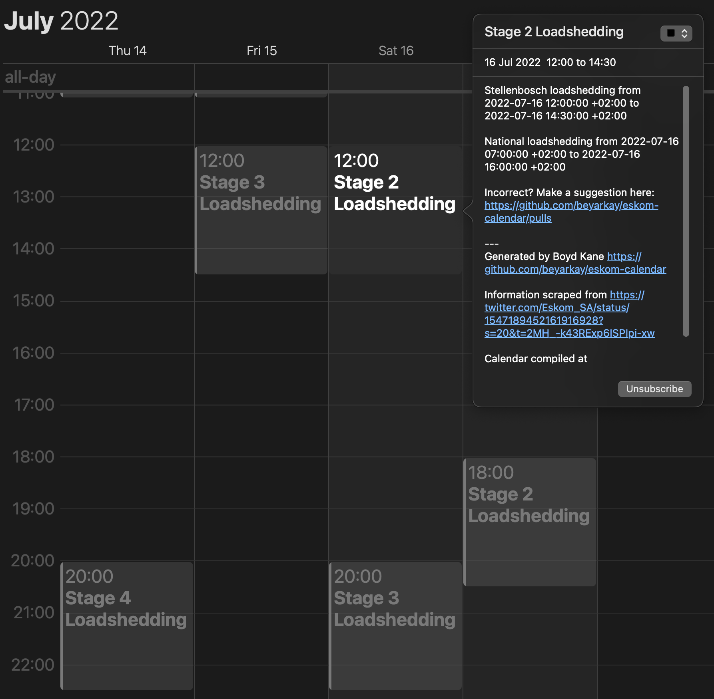

# Eskom Calendar 🔌 ⚡️

Sick and tired of complicated load shedding schedules? This project creates
up-to-date calendars that show you when load shedding is in your area.

To get your load shedding schedule in your calendar you should go to the
[latest release](https://github.com/beyarkay/eskom-calendar/releases) and
follow the instructions there.



## Similar apps
In the author's opinion, eskom-calendar is better than apps like EskomSePush,
because an event will only appear in your calendar if:
1. [Eskom](https://twitter.com/Eskom_SA) declares national loadshedding, and
2. Your area actually has loadshedding at that time, as defined by 
   [your areas loadshedding schedule](https://www.eskom.co.za/distribution/customer-service/outages/municipal-loadshedding-schedules/western-cape/).

What's more, eskom-calendar is open source! See below for how we keep it up to
date.

## Contributing
The project is also open source! We depend on pull requests to update
[`manually_specified.yaml`](https://github.com/beyarkay/eskom-calendar/blob/main/manually_specified.yaml)
with the latest schedule. Please [submit a PR to
`manually_specified.yaml`](https://github.com/beyarkay/eskom-calendar/edit/main/manually_specified.yaml)
if [Eskom](https://twitter.com/Eskom_SA) announces a change.

To add a new load shedding event, do the following:
1. Click [here](https://github.com/beyarkay/eskom-calendar/edit/main/manually_specified.yaml) to edit `manually_specified.yaml`.
    
   You'll see a bunch of `changes`. Each change lists one national load
   shedding event. It includes the stage, the start time, the end time, and the
   source. The source of a change explains where the information comes from,
   and should be a link to a tweet from the [official Eskom twitter
   account](https://twitter.com/Eskom_SA). It must be included or the calendars
   will not compile.
2. Add your changes to the TOP of the list. So the most recent loadshedding
   events are at the top, and the historical changes are at the bottom. For
   example:

```yaml
changes:
  # This is one change, indicating loadshedding stage 1 from 5am to 4pm on the
  # 18th of July 2022
  - stage: 1
    start: 2022-07-18T05:00:00     # Timestamp is +02:00 by default
    finsh: 2022-07-18T16:00:00     # Note that finish is spelt `finsh` so it lines up with `start`
    source: https://twitter.com/Eskom_SA/status/1547189452161916928?s=20&t=2MH_-k43RExp6ISPIpi-xw
  # This is another change, indicating loadshedding stage 2 from 4pm to
  # midnight on the 18th of July 2022
  - stage: 2
    start: 2022-07-18T16:00:00
    finsh: 2022-07-18T23:59:00
    source: https://twitter.com/Eskom_SA/status/1547189452161916928?s=20&t=2MH_-k43RExp6ISPIpi-xw
  ...
```

3. Once you've added your changes, scroll to the bottom where you see 
   `Propose changes` and add a commit message. The commit body must include the
   source where you got your information from.
4. Click the green button `Propose changes`
5. Check that your changes look good, and then click the button `Create pull request`

That's it! I'll review the PR and when I merge it, the calendars will
automatically be updated by GitHub actions.

