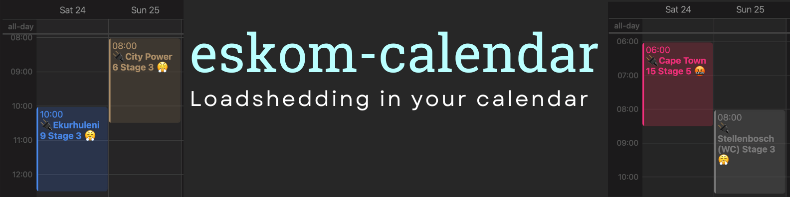

<div align="center">
  <h1 alt="Eskom-calendar: loadshedding in your calendar">
    <a  href="https://github.com/beyarkay/eskom-calendar/releases/tag/latest">
      
    </a>
  </h1>

  <a href="https://img.shields.io/github/downloads/beyarkay/eskom-calendar/latest/total?label=Calendar%20Downloads">
    
  </a>

  

  <a href="https://github.com/beyarkay/eskom-calendar/blob/docs/LICENSE">
    
  </a>

  <a href="https://github.com/beyarkay/eskom-calendar/actions">
    
  </a>

  <a href="https://github.com/beyarkay/eskom-calendar#contributors">
    
  </a>

  <a href="https://twitter.com/intent/tweet?text=Hey%20@beyarkay%20I%20love%20eskom-calendar!">
    
  </a>
  <br>
  <a href="https://ko-fi.com/beyarkay">
    
  </a>

  <a href="https://patreon.com/user?u=91320409&utm_medium=clipboard_copy&utm_source=copyLink&utm_campaign=creatorshare_creator&utm_content=join_link">
    
  </a>
  


  <p>
    Loadshedding schedules in your digital calendar. No apps, no ads, up-to-date, and developer friendly.
  </p>
  <a href="https://github.com/beyarkay/eskom-calendar/releases/tag/latest">Get it</a> •
  <a href="#easy-to-understand-and-plan-around">Key Features</a> •
  <a href="#using-the-data-in-your-own-projects">Using the data</a> •
  <a href="#project-goals-and-alternatives">Project goals & alternatives</a><br>
</div>

## How to Get It

Go to <a href="https://eskomcalendar.co.za" target="_blank">eskomcalendar.co.za</a>
and just type in your area! No apps, no adverts, no nonsense. If you want more 
information, keep reading.

## Testimonials

<table align="center">
  <tr>
    <th align="center">
      <a href="https://twitter.com/hermux/status/1549851414771503110" target="_blank">
       Creator of EskomSePush
      </a>
    </th>
    <th align="center">
      <a href="https://omny.fm/shows/living-redefined/you-can-now-add-the-load-shedding-schedule-directl?t=26s" target="_blank">
        SAfm
      </a>
    </th>
  </tr>
  <tr>
    <td align="center">
      <a href="https://twitter.com/hermux/status/1549851414771503110" target="_blank">
        
      </a>
    </td>
    <td align="center">
      <a href="https://omny.fm/shows/living-redefined/you-can-now-add-the-load-shedding-schedule-directl?t=26s" target="_blank">
        
      </a>
    </td>
  </tr>
  <tr>
    <th align="center">
      <a href="https://www.goodthingsguy.com/lifestyle/south-african-student-just-created-an-open-source-calendar-for-loadshedding" target="_blank">
        Good Things Guy
      </a>
    </th>
    <th align="center">
      <a href="https://www.sun.ac.za/english/Lists/news/DispForm.aspx?ID=9471" target="_blank">
        Stellenbosch University
      </a>
    </th>
  </tr>
  <tr>
    <td align="center">
      <a href="https://www.goodthingsguy.com/lifestyle/south-african-student-just-created-an-open-source-calendar-for-loadshedding/" target="_blank">
        
      </a>
    </td>
    <td align="center">
      <a href="https://www.sun.ac.za/english/Lists/news/DispForm.aspx?ID=9471" target="_blank">
        
      </a>
    </td>
  </tr>
</table>

## Key Features

### Easy to understand and plan around

eskom-calendar makes planning around loadshedding as easy as it gets. Subscribe
to the digital calendar for your area, and you'll see loadshedding in your
schedule on your phone, laptop, smartwatch, smartfridge, alles. We'll show you
loadshedding as far into the furture as Eskom allows us. 

### An event in your calendar means your lights are off

Many loadshedding apps don't actually tell you when your lights are off, or if
they do, it's difficult to find or only shows you the very next power outage.
eskom-calendar shows you all the times your lights will be off, right in your
digital calendar.

### Perfect for teams and businesses

If you're a team manager, add the calendars for your team members and know
exactly when everyone will go dark so you don't have someone dropping off in
the middle of a meeting.

Businesses can see loadshedding schedules for all their branches in one view,
and prepare accordingly. 

IT departments can automate turning on generators or shutting down servers (see
[Using the Data in Your Own Projects](#using-the-data-in-your-own-projects)).

### No adverts

eskom-calendar does one thing, and does it well. You get an event in your
calendar if your power is going to go off, and that's it. There's no adverts,
there's no bloat. Just loadshedding information. Doesn't get simpler than that,
does it?

### The *only* open source, automation friendly option

eskom-calendar was created by [Boyd Kane](https://github.com/beyarkay) because
there was no way for a casual coder to just get loadshedding information
programmatically without messing with API keys and whatnot.

To the best of our knowledge, this is the easiest way to automate away the
pain of loadshedding, and it's the only open-source option to provide the times
when power will be off, as opposed to just the loadshedding schedule for any
given area (please get in contact if I'm wrong!, would be great to collab).

## Using the Data in Your Own Projects

We are really interested to see what the developers of South Africa do with
this data source.

The main file of interest will be
[`machine_friendly.csv`](https://github.com/beyarkay/eskom-calendar/releases/download/latest/machine_friendly.csv)
built from the same source of information as the calendar files. It looks
something like:

```
       │ File: machine_friendly.csv
───────┼──────────────────────────────────────────────────────────────────────────────────────────────────────────────────────────────────────
   1   │ area_name,start,finsh,stage,source
   2   │ kwazulu-natal-mpofana,2022-09-25T23:00:00+02:00,2022-09-26T01:30:00+02:00,3,"https://twitter.com/Eskom_SA/status/1574014612097454080"
   3   │ kwazulu-natal-mpofana,2022-09-26T07:00:00+02:00,2022-09-26T09:30:00+02:00,3,"https://twitter.com/Eskom_SA/status/1574014612097454080"
   4   │ kwazulu-natal-mpofana,2022-09-26T16:00:00+02:00,2022-09-26T17:30:00+02:00,4,"https://twitter.com/Eskom_SA/status/1574014612097454080"
```

and you can just `curl` the file to get ahold of it. So go wild! DDoS Github if
you want to 😉. There are plenty of ideas floating around and I'd love to see
more. Note that the header is `finsh`, *not* `finish` (so that it lines up
nicely with `start`)

#### Simply download the CSV via `curl` (`-s` to be silent, `-L` to follow redirects)
```sh
curl -sL https://github.com/beyarkay/eskom-calendar/releases/download/latest/machine_friendly.csv
area_name,stage,start,finsh,source
free-state-seretse,4,2022-09-10T10:00:00+02:00,2022-09-10T12:30:00+02:00,"https://twitter.com/Eskom_SA/status/1568494585113976835"
free-state-seretse,4,2022-09-10T18:00:00+02:00,2022-09-10T20:30:00+02:00,"https://twitter.com/Eskom_SA/status/1568494585113976835"
...
```

#### Get all data for a specific area
```sh
curl -sL https://github.com/beyarkay/eskom-calendar/releases/download/latest/machine_friendly.csv \
  | grep stellenbosch
western-cape-stellenbosch,4,2022-09-10T14:00:00+02:00,2022-09-10T16:30:00+02:00,"https://twitter.com/Eskom_SA/status/1568494585113976835"
western-cape-stellenbosch,4,2022-09-10T22:00:00+02:00,2022-09-11T00:30:00+02:00,"https://twitter.com/Eskom_SA/status/1568494585113976835"
...
```

#### Get all data for a certain day in a certain area
```sh
curl -sL https://github.com/beyarkay/eskom-calendar/releases/download/latest/machine_friendly.csv \
  | grep cape-town-area-15 \
  | grep 2022-09-11
city-of-cape-town-area-15,4,2022-09-11T00:00:00+02:00,2022-09-11T02:30:00+02:00,"https://twitter.com/Eskom_SA/status/1568494585113976835"
city-of-cape-town-area-15,4,2022-09-11T08:00:00+02:00,2022-09-11T10:30:00+02:00,"https://twitter.com/Eskom_SA/status/1568494585113976835"
...
```

#### Get the file in Python 

(mac users you might need [this](https://stackoverflow.com/a/60671292/14555505)
if you get an SSL error)

```python
import pandas as pd
url = "https://github.com/beyarkay/eskom-calendar/releases/download/latest/machine_friendly.csv"
df = pd.read_csv(url, parse_dates=['start', 'finsh'])
```

Feel free to open a PR with any other snippets or languages you think of!

## Project Goals and Alternatives

eskom-calendar tries to achieve the following goals:

- Be open-source, easy to integrate with, and encouraging of new ideas
- Provide an accesible information source for loadshedding in South Africa
- Be dead simple to use

eskom-calendar does not try to:

- Solve every solution itself. It embraces the Unix philosophy of `do one
  thing, and do it well`. Calendars are provided as an example of what's
  possible, but the heart of it is the open-source data with which websites,
  apps, bots, automations, etc, can be built.
- Compete. eskom-calendar tries to be the best product for users, but chasing
  "competitors" is distracting at best, pointless at worst.

The best known alternative would be [EskomSePush](https://sepush.co.za/), but
the author didn't want another app, and wanted to see the whole loadshedding
schedule at a glance. Hence eskom-calendar was born (making it open source was
just the default).

## Contributors

<!-- ALL-CONTRIBUTORS-BADGE:START - Do not remove or modify this section -->
[](#contributors-)
<!-- ALL-CONTRIBUTORS-BADGE:END -->

[Boyd Kane](https://github.com/beyarkay) is the creator and maintainer. Reach out
on [twitter](https://twitter.com/beyarkay) if you want to chat in private, otherwise
[open an issue](https://github.com/beyarkay/eskom-calendar/issues/new)!


<!-- ALL-CONTRIBUTORS-LIST:START - Do not remove or modify this section -->
<!-- prettier-ignore-start -->
<!-- markdownlint-disable -->
<table>
  <tbody>
    <tr>
      <td align="center" valign="top" width="14.28%"><a href="https://github.com/beyarkay"><br /><sub><b>Boyd Kane</b></sub></a><br /><a href="https://github.com/beyarkay/eskom-calendar/commits?author=beyarkay" title="Tests">⚠️</a> <a href="https://github.com/beyarkay/eskom-calendar/commits?author=beyarkay" title="Code">💻</a> <a href="https://github.com/beyarkay/eskom-calendar/issues?q=author%3Abeyarkay" title="Bug reports">🐛</a> <a href="https://github.com/beyarkay/eskom-calendar/commits?author=beyarkay" title="Documentation">📖</a> <a href="#maintenance-beyarkay" title="Maintenance">🚧</a></td>
      <td align="center" valign="top" width="14.28%"><a href="https://github.com/shaunkleyn"><br /><sub><b>Shaun</b></sub></a><br /><a href="#maintenance-shaunkleyn" title="Maintenance">🚧</a></td>
    </tr>
  </tbody>
</table>

<!-- markdownlint-restore -->
<!-- prettier-ignore-end -->

<!-- ALL-CONTRIBUTORS-LIST:END -->
## Contributing

Please see [`CONTRIBUTING.md`](https://github.com/beyarkay/eskom-calendar/blob/docs/CONTRIBUTING.md).

## Support

This project is funded by vibes and good words at the moment. If you like what I do,
or you use the project commercially, please consider supporting me:

- <a href="https://ko-fi.com/beyarkay">
    
  </a>
- <a href="https://patreon.com/user?u=91320409&utm_medium=clipboard_copy&utm_source=copyLink&utm_campaign=creatorshare_creator&utm_content=join_link">
    
  </a>


